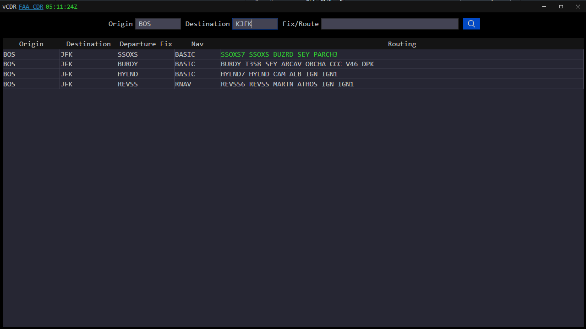

# **vCDR**
## **Description**
Virtual Coded Departure Routes is a datbase query provided via download from the FAA, it provides common routes between airports and ARTTCs.

# **Documentation**
## **Getting Started**
- Only one search field is required to query the database.
- Preferred routes will be highlighted in green, while these are not set and stone routes that are 100% valid, they tend to be very accurate.
- Double clicking the route within the row will allow you to edit the route, this does not change the database, but allows CTRL+A and CTRL+C to copy any portion of the route.
## **Query**
1) enter an origin, this can be a 3-4 character airport designator, or a 3 character ARTCC code.
2) enter a destination, this can be a 3-4 character airport designator, or a 3 character ARTCC code.
3) enter a portion of the route, this can be a SID/RNAV FIX/BEACON FIX/STAR.
4) press enter while in any of the search text boxes, or click the blue search button.
